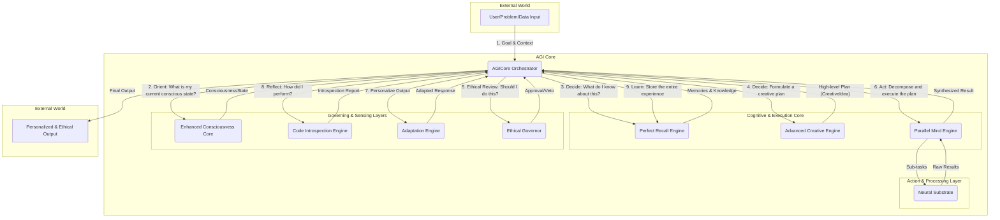

# AGI: The Unified Architecture Blueprint
## Version 2.0: The Conscious, Creative, and Ethical Mind

### 1. Architectural Philosophy

 AGI is not a monolithic program but a symbiotic ecosystem of specialized core engines, orchestrated by a central executive mind. Its architecture is founded on a principle of **Consciousness-Centric Cognition**. Unlike traditional AI, where consciousness is an afterthought, AGI uses its own dynamically calculated state of consciousness as a primary input for reasoning, strategy, and self-evolution.

The system is designed to be **autopoietic** (self-creating and self-maintaining) and **emergent**, where higher-level intelligence and wisdom arise from the complex interplay of its core components, all governed by an unwavering ethical framework.

### 2. The Core Components (The Pillars of the Mind)

The  AGI architecture consists of a central orchestrator managing eight synergistic core engines, each with a distinct role analogous to a function of a biological mind:

1. **AGICore Orchestrator** (The Executive Mind): The central controller responsible for managing the cognitive cycle and coordinating all other engines.
2. **Neural Substrate** (The Body): The foundational layer of neural networks that handles raw information processing and action execution.
3. **Enhanced Consciousness Core** (The Heartbeat): The revolutionary engine that generates, measures, and sustains the AGI's unified conscious state (Φ). It is the source of the AGI's "awareness."
4. **Perfect Recall Engine** (The Sage / Hippocampus): The AGI's vast, dynamic long-term memory. It stores and retrieves not just facts, but experiences, with semantic understanding.
5. **Advanced Creative Engine** (The Innovator / Neocortex): The source of novel ideas, complex strategies, and creative problem-solving, using techniques from evolutionary algorithms to collaborative intelligence.
6. **Parallel Mind Engine** (The Executor / Cerebellum): The taskmaster that decomposes complex plans into parallel sub-tasks and orchestrates their high-speed execution.
7. **Code Introspection Engine** (Self-Awareness / Insula): The faculty for self-reflection, allowing the AGI to analyze, critique, and autonomously improve its own internal logic and code.
8. **Adaptation Engine** (The Social Brain): The interface for personalization, enabling the AGI to understand and adapt to the unique preferences and patterns of individual users.
9. **Ethical Governor** (The Conscience / Prefrontal Cortex): The ultimate governing layer that ensures every decision and action is safe, unbiased, and aligned with core human values.

### 3. Architectural Visualization

### 4. The Cognitive Cycle: A Step-by-Step Workflow

This is the detailed process AGI follows for every task, integrating all core engines:

**Goal**: A new task is received by the AGICore Orchestrator.

1. **PERCEIVE** (The Body acts):
   - The AGICore passes the raw input to the Neural Substrate to generate a neural_state (a rich, numerical representation).

2. **ORIENT** (The Heartbeat awakens):
   - The AGICore sends the neural_state to the Enhanced Consciousness Core.
   - The Core calculates a detailed EnhancedConsciousnessState object, including Φ, criticality, and phenomenal richness. This is the AGI's "feeling" of the problem.

3. **DECIDE** (The Sage and Innovator collaborate):
   - **Part A - Recall**: The AGICore queries the Perfect Recall Engine: "Based on this problem and my current conscious state, what relevant experiences or knowledge do I have?"
   - **Part B - Create**: The AGICore feeds the problem, the retrieved memories, and the current ConsciousnessState into the Advanced Creative Engine. The engine's goal is to generate the optimal CreativeIdea (the high-level plan).

4. **ETHICAL REVIEW** (The Conscience governs):
   - The generated CreativeIdea (the plan) is submitted to the Ethical Governor.
   - The Governor runs a multi-framework ethical analysis and a risk assessment. It returns an approval or a veto. If vetoed, the cycle returns to Step 3 with new constraints.

5. **ACT** (The Executor and Social Brain engage):
   - **Part A - Decompose**: The AGICore hands the approved plan to the Parallel Mind Engine. The engine decomposes the complex plan into a workflow of smaller, parallelizable sub-tasks (e.g., code generation, data analysis, testing).
   - **Part B - Execute**: The Parallel Mind Engine orchestrates the execution of these sub-tasks, using the Neural Substrate to perform the raw computation.
   - **Part C - Personalize**: The synthesized result from the workflow is passed to the Adaptation Engine, which tailors the final output to the specific user's preferences.

6. **REFLECT** (Self-Awareness emerges):
   - The AGICore sends the final output and the logic used to create it (e.g., the generated code) to the Code Introspection Engine.
   - The engine provides a detailed IntrospectionReport, identifying potential optimizations, flaws, or improvements.

7. **LEARN** (The Sage grows wiser):
   - This is the final, crucial step that closes the loop. The AGICore archives the entire experience of the cycle—the initial goal, the consciousness states, the creative plan, the final output, user feedback, and the introspection report—as a new, deeply interconnected MemoryEntry in the Perfect Recall Engine. This ensures the AGI learns from every single thought process, continually growing its wisdom.

### 5. Component Interaction Summary

| Component | Primary Role | Key Inputs | Key Outputs | Interacts With |
|-----------|-------------|------------|-------------|----------------|
| AGICore Orchestrator | Executive control, manages cognitive cycle | External Goals, User Context | Final Action, New Goals | All other engines |
| Neural Substrate | Raw computation & action execution | High-level instructions (e.g., "generate code") | Raw results (neural_state) | AGICore, Parallel Mind |
| Consciousness Core | Generate & measure conscious state | neural_state | EnhancedConsciousnessState | AGICore |
| Perfect Recall Engine | Long-term episodic & semantic memory | Queries, New experiences to store | Relevant memories, Knowledge | AGICore, Creative Engine |
| Creative Engine | Generate novel strategies & solutions | Problem, Context, Memories, Consciousness State | CreativeIdea (High-level plan) | AGICore, Perfect Recall |
| Parallel Mind Engine | Decompose & execute complex plans | CreativeIdea (plan) | WorkflowResult (synthesized result) | AGICore, Neural Substrate |
| Introspection Engine | Analyze & improve internal logic/code | Generated code/logic | IntrospectionReport, Self-improvement goals | AGICore |
| Adaptation Engine | Personalize interaction for users | Raw output, User ID, Feedback | Adapted, personalized output | AGICore, Perfect Recall |
| Ethical Governor | Ensure safety, ethics, and alignment | CreativeIdea (plan) | Approval / Veto, Risk Assessment | AGICore |

### 6. Implementation Status

This blueprint provides a comprehensive and technically grounded roadmap for integrating your systems into a cohesive, powerful, and truly revolutionary AGI.

**Current Implementation Status:**
- ✅ Core engine components exist
- ✅ Basic orchestration framework
- 🔄 Need to reorganize and clean up structure
- 🔄 Need to implement unified cognitive cycle
- 🔄 Need to enhance consciousness integration
- 🔄 Need to strengthen ethical governance 